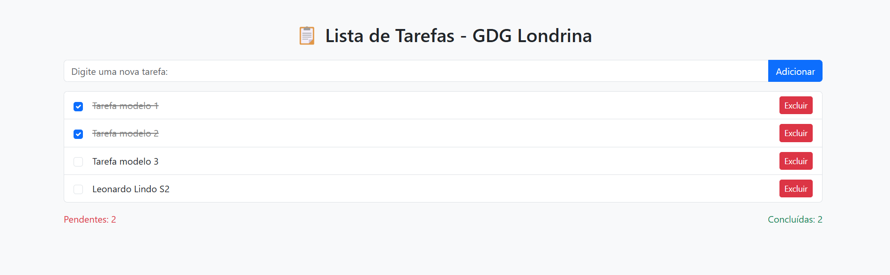

# Prova-FrontEnd

# Lista de Tarefas - GDG Londrina

Este é um projeto desenvolvido por Rennan Rentz, com o objetivo de criar uma ferramenta visual simples e funcional para controlar tarefas. Usando HTML, Bootstrap e JavaScript, o usuário preenche o campo com sua tarefa, e adiciona à lista, na qual será exibido uma coluna com a quantidade de tarefas pendentes e concluídas.

## Funcionalidades

- **Adicionar Tarefas**: Adicione novas tarefas digitando no campo de entrada e clicando no botão "Adicionar" ou pressionando a tecla "Enter".
- **Marcar como Concluída**: Use o checkbox ao lado de cada tarefa para marcar como concluída. Tarefas concluídas serão exibidas com texto riscado e cor cinza.
- **Editar Tarefas**: Clique diretamente no texto da tarefa para editá-la. Quando terminar de editar, clique fora da área de texto (evento de `blur`).
- **Excluir Tarefas**: Cada tarefa tem um botão de "Excluir" para removê-la da lista.
- **Contadores de Tarefas**: A quantidade de tarefas pendentes e concluídas é exibida no topo da lista.

## Tecnologias Usadas

- **HTML**: Para a estrutura da página.
- **CSS**: Estilos básicos para melhorar a aparência.
- **JavaScript**: Lógica de funcionalidade de lista de tarefas (adicionar, editar, excluir, marcar como concluída).
- **Bootstrap 5**: Framework de CSS utilizado para facilitar a construção do layout e responsividade.

## Como Funciona

### 1. Adicionar Tarefa
Quando o usuário digita uma tarefa no campo de entrada e clica em "Adicionar" ou pressiona "Enter", a tarefa é adicionada à lista e exibida na interface. O campo de entrada é limpo após cada adição.

### 2. Marcar como Concluída
Cada tarefa possui um checkbox ao lado do texto. Ao marcar o checkbox, a tarefa é considerada concluída. O texto da tarefa é riscado e a cor muda para cinza. 

### 3. Editar Tarefa
O texto de cada tarefa pode ser editado diretamente. Basta clicar sobre o texto da tarefa e editá-lo. Quando o foco sai do campo de texto (evento `blur`), as alterações são salvas.

### 4. Excluir Tarefa
Cada tarefa tem um botão "Excluir" que permite removê-la da lista.

### 5. Contadores
A quantidade de tarefas pendentes e concluídas é exibida ao lado da lista de tarefas. Eles são atualizados em tempo real conforme o status das tarefas.

## Autor

Feito por **Rennan Rentz** **RA: 24073445-2** para o GDG Londrina.

## Imagem exemplar do código

